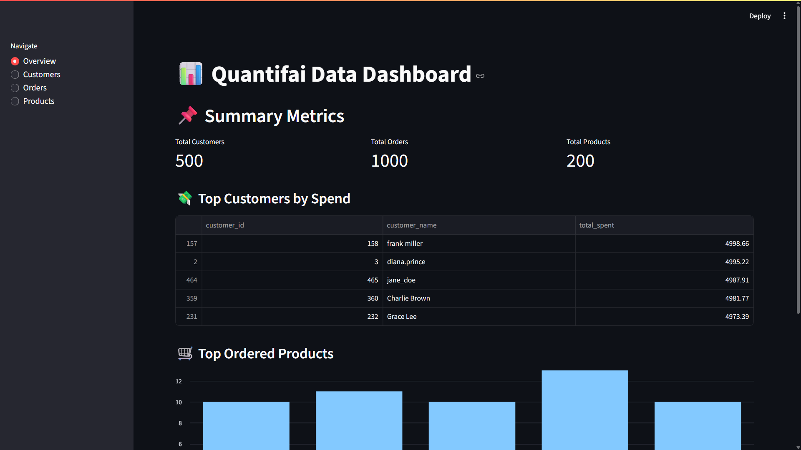

# Retail Data ETL & Dashboard

A complete end-to-end ETL pipeline that processes messy e-commerce datasets, stores the cleaned data in a relational database (SQLite), and presents insights through an interactive Streamlit dashboard powered by Plotly.

---

## Features

- Clean and transform raw e-commerce product & customer datasets
- Handle missing values, remove duplicates, normalize fields
- Load structured data into SQLite database
- Visualize data insights with Streamlit + Plotly
- Modular ETL pipeline using Python (Pandas, NumPy)

---

## Technologies Used

- Python (Pandas, NumPy)
- SQLite (via `sqlite3`)
- Streamlit for dashboard UI
- Plotly for interactive visualizations

---

## How to Run Locally

### 1. Clone the Repository
    ```bash
    git clone https://github.com/adityakale3115/retail-etl-dashboard.git
    cd retail-etl-dashboard
### 2. Install Requirements
      ```bash
      pip install -r requirements.txt

### 3. Run ETL Pipeline
      ```bash
      python etl/extract.py
      python etl/transform.py
      python etl/load.py

### 4. Launch Dashboard
      ```bash
      streamlit run dashboard/app.py

### Dashboard Overview


